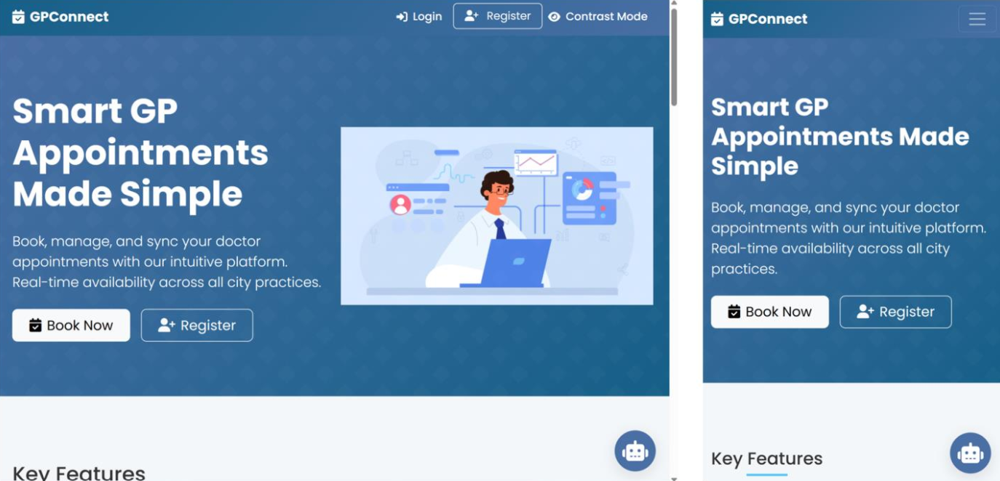
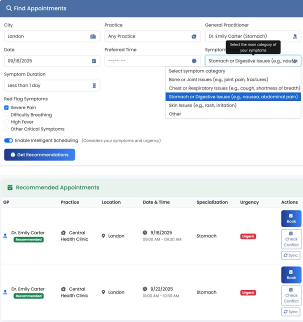
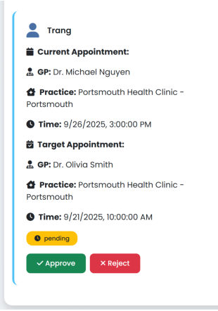
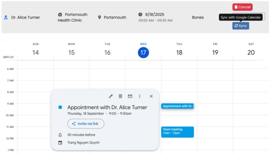

# Healthcare Appointment Booking System

A full-stack web-based healthcare appointment booking system developed as part of an MSc Information Systems project at the University of Portsmouth.

The system improves appointment flexibility and usability through city-wide GP appointment search, intelligent scheduling, appointment swapping, Google Calendar integration, and automated notifications.

> **Academic prototype:** Developed using simulated data for research and demonstration purposes. It is not intended for clinical use.




## Key Features

- **City-wide appointment search** - Search available GP appointments across practices within a selected city.
- **Intelligent scheduling & triage** - Recommend suitable appointments based on availability, symptoms, urgency, preferred time, and GP preferences.
- **Appointment swapping** - Request eligible same-practice appointment swaps with administrator approval.
- **Google Calendar integration** - Check calendar conflicts and synchronise confirmed appointments with Google Calendar.
- **Automated email notifications** - Send appointment-related notifications using Nodemailer and Brevo SMTP.
- **Patient preferences** - Store GP and scheduling preferences to support personalised appointment recommendations.
- **Appointment management** - Search, book, view, and cancel appointments.
- **Post-appointment feedback** - Collect patient ratings and comments following appointments.
- **Accessible & responsive interface** - Support different screen sizes, contrast mode, and accessibility-focused interaction.
- **Support chatbot** - Provide lightweight guidance for common system tasks.
- **Role-based functionality** - Support patient and administrative workflows.


## Core Workflows

### City-wide Appointment Search

Users can search for available GP appointments across multiple practices within a selected city rather than being limited to a single practice.

Searches can be refined by **practice, GP, and date**, providing broader appointment visibility while retaining user control over appointment selection.


### Intelligent Scheduling & Triage

When Intelligent Scheduling is enabled, the recommendation process considers:

- Symptom category
- Symptom duration
- Red-flag symptoms
- Preferred appointment time
- GP preferences
- Appointment availability

Rule-based triage classifies scheduling priority as **Urgent**, **Soon**, or **Routine**. The system then uses this information alongside patient preferences and appointment availability to recommend suitable appointment options.

The feature supports appointment scheduling only. It does not provide medical diagnosis or use machine-learning-based clinical decision making.




### Appointment Swapping

Patients can request to exchange an existing appointment with an eligible booked appointment within the same practice.

Swap requests are submitted for administrator review. The administrator can approve or reject the request before appointment ownership is updated, providing additional scheduling flexibility while maintaining administrative control.




## Integrations

### Google Calendar

Google Calendar integration allows users to check whether an appointment conflicts with an existing calendar event and synchronise confirmed appointments with their Google Calendar.

OAuth 2.0 is used to authorise access to the user's calendar.




### Email Notifications

The application uses **Nodemailer with Brevo SMTP** to deliver automated appointment-related email notifications.

Notifications are generated for events such as:

- Appointment bookings
- Appointment cancellations
- Appointment swap outcomes

SMTP credentials and sender configuration are managed through environment variables and are excluded from version control.


## Tech Stack

| Area | Technologies |
| --- | --- |
| Frontend | EJS, HTML5, CSS3, JavaScript, Bootstrap |
| Backend | Node.js, Express.js |
| Database | PostgreSQL |
| Authentication & Security | JWT, bcrypt, parameterised SQL |
| Calendar Integration | Google Calendar API, OAuth 2.0 |
| Email | Nodemailer, Brevo SMTP |
| Development | Git, GitHub, npm |


## Project Structure

```text
src/
├── config/
│   ├── db.js
│   └── initDb.js
├── middleware/
│   └── auth.js
├── public/
│   ├── css/
│   ├── images/
│   └── js/
├── routes/
│   ├── admin.js
│   ├── appointments.js
│   ├── calendar.js
│   └── users.js
├── utils/
│   ├── googleCalendar.js
│   └── sendEmail.js
└── views/
    ├── partials/
    └── *.ejs
```


## Getting Started

### Prerequisites

Before running the application, make sure you have:

- Node.js
- npm
- PostgreSQL

Google Calendar integration requires a Google Cloud project with the Google Calendar API enabled.

Email notifications require Brevo SMTP credentials or another compatible SMTP provider.


### Installation

1. Clone the repository:

```bash
git clone https://github.com/quhtrang-cloud/gpconnect-healthcare-booking-system.git
```

2. Navigate to the project directory:

```bash
cd gpconnect-healthcare-booking-system
```

3. Install dependencies:

```bash
npm install
```

4. Create a `.env` file using `.env.example` as a template and configure the required environment variables.

5. Make sure PostgreSQL is running and the configured database is available.

6. Start the application:

```bash
npm start
```

7. Open the application in your browser:

```text
http://localhost:3000
```


## Environment Variables

The application uses environment variables for database connectivity, authentication, Google Calendar integration, email delivery, and application configuration.

Refer to `.env.example` for the required configuration.

```env
DATABASE_URL=

JWT_SECRET=

GOOGLE_CLIENT_ID=
GOOGLE_CLIENT_SECRET=
GOOGLE_REDIRECT_URI=http://localhost:3000/api/calendar/callback

SMTP_HOST=smtp-relay.brevo.com
SMTP_PORT=587
SMTP_USER=
SMTP_PASS=

EMAIL_FROM=
EMAIL_FROM_NAME=GPConnect
SUPPORT_EMAIL=

APP_TIMEZONE=Europe/London
APP_URL=http://localhost:3000
```

> Never commit the real `.env` file, passwords, API credentials, access tokens, or other secrets to version control.


## Project Background

This application was developed as part of an MSc Information Systems dissertation investigating flexibility, usability, and accessibility in web-based healthcare appointment systems.

The prototype explores approaches to addressing limitations identified in existing appointment-booking systems, particularly restricted appointment visibility, limited scheduling flexibility, and usability barriers affecting older and digitally excluded users.

Development followed a user-centred and iterative approach, with the interface designed around responsive interaction and WCAG 2.2 accessibility principles.

All healthcare, patient, GP, and appointment data used by the prototype is simulated.


## Limitations & Future Development

This project is an academic prototype rather than a production healthcare platform. Potential future development includes:

- Production-grade authentication, such as NHS-compatible identity integration
- Formal WCAG 2.2 accessibility evaluation and representative user testing
- More comprehensive Google Calendar synchronisation and conflict resolution
- Expanded patient preference and personalisation options
- Production monitoring, structured logging, and audit trails
- Automated unit, integration, and end-to-end testing
- Performance, load, stress, and scalability testing
- Production deployment with HTTPS/TLS and additional security controls


## Disclaimer

This application is an **academic prototype** developed for educational, research, and demonstration purposes.

It uses simulated data, does not connect to real NHS patient systems, and is **not intended for clinical use or medical diagnosis**.

This project is not affiliated with NHS England's **GP Connect** service.


## Author

**Quynh Trang Nguyen**

[Portfolio](https://my-portfolio-ivory-ten-46.vercel.app/)
[LinkedIn](https://www.linkedin.com/in/quynh-trang-nguyen-21a559334/)
